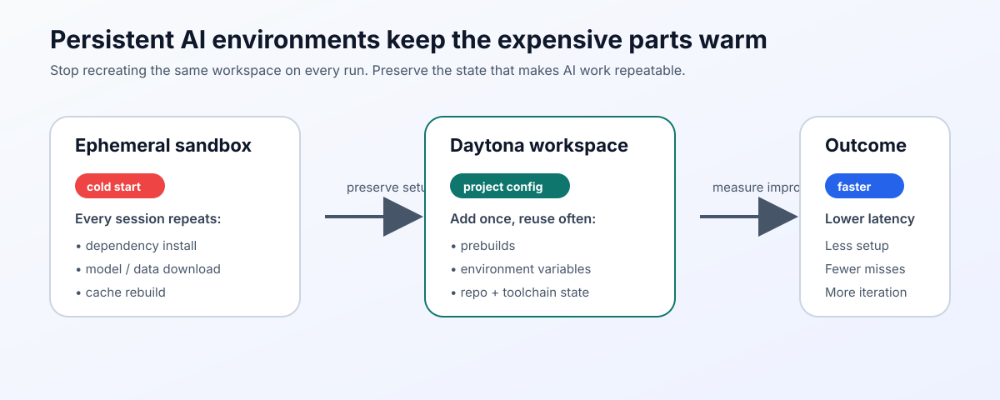

# Persistent AI Environments Beyond Ephemeral Sandboxes

AI development is not a single, clean compile-and-run loop. It is a repeated
cycle of cloning repositories, installing dependencies, pulling models, warming
caches, indexing data, running evals, and then doing it all again after the
next prompt, branch, or experiment. That is why the limits of an [ephemeral
environment](../definitions/20240819_definition_ephemeral%20environment.md)
show up so quickly in real AI work.

A disposable sandbox is great when you want a clean slate. It is much less
helpful when your workflow depends on local embeddings, a warm Python
environment, a preloaded dataset, or a tuned toolchain that you need again
tomorrow. A persistent AI environment gives you a better middle ground: keep
the important state, keep the setup deterministic, and stop paying the startup
tax over and over.



## TL;DR

- Ephemeral sandboxes are ideal for one-off tasks, but they waste time when AI work depends on reusable state.
- Persistent environments keep the expensive parts warm: dependencies, caches, data, and project configuration.
- Daytona helps you make that persistence reproducible with [workspaces](../definitions/20240819_definition_daytona%20workspace.md), project configs, and prebuilds.
- Measure startup time in your own workflow instead of guessing.
- The right pattern is usually "persistent where repetition hurts, ephemeral where isolation matters."

## Why Ephemeral Sandboxes Break Down

The biggest problem with ephemeral sandboxes is not that they are temporary. It is that they are _too_ temporary for iterative AI work.

When a sandbox is recreated from scratch, you pay for the same steps again:

- reinstalling package managers and dependencies,
- downloading model artifacts or tokenizer assets,
- rebuilding vector indexes and caches,
- rehydrating local databases or test fixtures,
- re-authenticating to services and secret stores.

That cost adds up quickly for AI teams because the workflow is rarely linear.
A developer may spin up an environment to tune a prompt, run a benchmark,
patch a retrieval pipeline, and then revisit the same workspace 20 minutes
later. If the environment disappears every time, the team spends more effort
recovering context than producing value.

That is where a persistent environment changes the economics. Instead of treating every session as a full rebuild, you keep the parts that are expensive to reproduce and reset only the parts that should stay clean.

**Key point:** persistence is not about never resetting anything. It is about keeping the _right_ things alive.

## What a Persistent AI Environment Actually Needs

A useful persistent AI environment is more than a machine that stays on.

It needs a few properties at the same time:

| Requirement | Why it matters | Daytona pattern |
| --- | --- | --- |
| Reproducible setup | You need a predictable baseline every time the workspace is created. | Put dependencies and repo-specific configuration into a project config. |
| Warm startup path | The expensive work should happen before the user waits on it. | Use prebuilds for heavy installs, language runtimes, and common tooling. |
| Stateful reuse | AI work often depends on caches, indexes, and local artifacts. | Keep the workspace and reuse it instead of recreating it from zero. |
| Controlled drift | Persistence without control creates stale environments. | Refresh the config, rebuild prebuilds, and prune old state regularly. |
| Cost visibility | Persistent resources can become idle spend if nobody watches them. | Track usage, stop idle workspaces, and choose the smallest viable shape. |

This balance matters because persistence can be a feature or a trap. If you preserve state without a plan, you inherit stale dependencies, old secrets, and hidden complexity. If you throw everything away, you pay a startup cost every time a developer or agent wants to do useful work.

## Set Up a Persistent AI Workflow in Daytona

Daytona is a strong fit here because it lets you define the environment once and reuse it many times. The goal is not to hand-craft a snowflake machine. The goal is to create a workspace that can be recreated consistently and resumed quickly.

### 1. Start the Daytona server

```bash
daytona server
```

If you are working locally, this gives you the control plane for managing workspaces and project config.

### 2. Register your Git provider

```bash
daytona git-providers add
```

That lets Daytona connect to your source repository and keep the environment tied to a real project, not just an ad hoc shell session.

### 3. Create a project config

A project config is where you define the baseline for the workspace: repository URL, environment variables, and the setup you want repeated every time.

```bash
daytona project-config add
```

Use this step to pin the boring but important details:

- the repo you want to open repeatedly,
- the runtime version you expect,
- the environment variables your AI tools need,
- any service endpoints or credentials that should be injected at runtime.

### 4. Add a prebuild for heavyweight dependencies

If your AI workflow always needs the same expensive setup, move it into a prebuild.

```bash
daytona prebuilds add
```

This is where persistent environments earn their keep. A prebuild can absorb the slowest part of the workflow so that the next workspace starts closer to "ready" and farther from "still installing."

### 5. Create and reuse the workspace

Once the project config and prebuild exist, create the workspace from the same source every time:

```bash
daytona create https://github.com/daytonaio/content --name ai-speed-check
```

The value here is not just that the workspace exists. It is that the environment has a stable, repeatable shape that the team can return to.

## Measure Startup Time Instead of Guessing

Speed is easy to talk about and surprisingly hard to measure. The simplest way to avoid hand-waving is to time your workspace creation directly.

Here is a small Python example that measures the wall-clock time for a Daytona workspace create operation:

```python
import subprocess
import time

cmd = [
    "daytona",
    "create",
    "https://github.com/daytonaio/content",
    "--name",
    "ai-speed-check",
]

start = time.perf_counter()
subprocess.run(cmd, check=True)
elapsed_ms = (time.perf_counter() - start) * 1000
print(f"Daytona workspace ready in {elapsed_ms:.0f} ms")
```

Use that baseline before and after you add prebuilds or trim setup steps. If the workspace is still slow, look at the slowest part of the chain:

- dependency installation,
- model download,
- repo checkout,
- index rebuild,
- first command startup inside the workspace.

**Practical tip:** measure the whole path from "open workspace" to "first productive command," not just the CLI response time. For AI teams, that full path is what users actually feel.

## When Persistence Pays Off the Most

Persistent AI environments are especially useful when the work is stateful or repeatable.

### Agentic coding loops

AI coding assistants often need the same repository, the same dependencies, and
the same toolchain across many short iterations. If each attempt starts from
zero, the loop gets slower and more brittle. A persistent workspace keeps the
context warm and reduces the chance that the agent spends its budget rebuilding
the environment.

### Retrieval pipelines and embeddings

If your workflow relies on vector databases, document indexes, or cached chunks, persistence avoids re-ingesting the same corpus every time. That is a direct performance win and a cost win.

### Benchmarking and evaluation

Evaluation runs should be repeatable. A persistent environment gives you a stable baseline for comparing prompt changes, model settings, or tool behavior. You still want to re-run the benchmark cleanly when necessary, but you do not want to rebuild the world on every test cycle.

### Demos, onboarding, and incident response

Persistent workspaces are also useful when people need a known-good environment fast. A demo environment should not spend its first five minutes installing packages. A new teammate should not spend half a day recreating the same setup your team already solved.

## Comparison: Ephemeral Sandbox vs. Persistent Environment

| Dimension | Ephemeral sandbox | Persistent AI environment |
| --- | --- | --- |
| Startup speed | Often slower on repeated use because setup repeats | Faster after the first build because state is reused |
| State retention | Minimal or none | Keeps the useful parts of the workflow warm |
| Consistency | Can be consistent, but only if recreated perfectly | Consistent when driven by a strong config and prebuild |
| Cost profile | Good for short, isolated tasks | Better for recurring work where setup time is expensive |
| Operational risk | Low risk of stale state, but high restart cost | Higher risk of drift if not maintained well |
| Best use case | Short-lived experiments, disposable tests, throwaway tasks | Repeated AI development, benchmarks, agent loops, and team workflows |

The trade-off is simple: ephemeral sandboxes optimize for cleanliness, while persistent environments optimize for reuse. Most AI teams need both.

## The Trade-Offs You Should Not Ignore

Persistence is not free.

If you keep environments around, you need to manage the consequences:

- **Drift:** stale dependencies or old branches can linger if nobody refreshes the workspace.
- **Security:** long-lived environments need the same secret hygiene as production systems.
- **Idle cost:** an always-on machine may be simpler, but it can become expensive quickly.
- **False confidence:** a warm environment can hide missing setup steps that will break in a fresh clone.

The mitigation is straightforward:

1. keep the source of truth in code and project config,
2. rebuild prebuilds on a schedule or when dependencies change,
3. stop idle workspaces,
4. rotate secrets and remove stale artifacts,
5. test from a fresh environment occasionally to prove the setup still works.

That discipline is what turns persistence from a convenience into an operational advantage.

## Conclusion

Persistent AI environments are not a rejection of ephemeral sandboxes. They are a response to the parts of AI development that are too expensive to recreate every time.

If your team repeatedly downloads the same dependencies, rebuilds the same
indexes, or spends too much time waiting for a clean environment to catch up, a
persistent workspace can remove a lot of friction. Daytona gives you the tools
to make that persistence reproducible: project configs, prebuilds, and reusable
workspaces.

The core idea is simple: keep the expensive state, measure the startup path, and reset only when you need to. That is how you get speed without losing control.

## References

- [Persistent Storage for AI Workloads](https://cloud.google.com/architecture/ai-ml/storage-for-ai-ml#:~:text=In%20addition%20to%20its%20use,effective%20and%20reliable%20block%20storage.)
- [Cost Control for AI Development](https://www.restack.io/p/cost-control-ai-projects-answer-cost-management-cat-ai)
- [Ephemeral environment definition](../definitions/20240819_definition_ephemeral%20environment.md)
- [Daytona workspace definition](../definitions/20240819_definition_daytona%20workspace.md)
