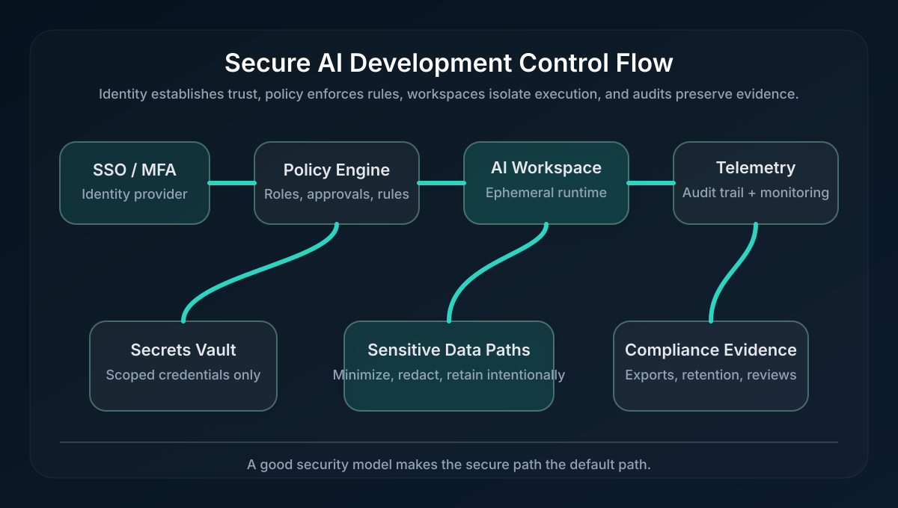

# Enterprise-Grade Security for AI Development Infrastructure

# Introduction

AI development infrastructure has become the new control plane for product work.
When engineers spin up a workspace to test prompts, evaluate models, inspect logs,
or ship agentic features, that workspace often touches sensitive code, customer
context, secrets, and telemetry. If the environment is not built with security
in mind, the result is predictable: scattered credentials, untracked access,
unclear retention, and a compliance story that falls apart under review.

That is why enterprise-grade security cannot be treated as an afterthought. A
useful AI platform must make the secure path the easy path. It needs strong
identity controls, isolated workspaces, consistent audit trails, and a privacy
model that fits modern regulations like SOC2 and GDPR. In this guide, we will
walk through the operational controls that matter most, show how they fit
together, and finish with a practical checklist teams can use before they roll
an AI development platform out to more users.

## TL;DR

- **Security must be designed into the workspace**: identity, isolation,
  secrets, logging, and retention all need clear ownership.
- **Compliance is evidence-driven**: SOC2 and GDPR readiness comes from repeatable
  controls, not from a one-time policy document.
- **Privacy by design reduces risk early**: minimize sensitive data exposure,
  scope access tightly, and make deletion and retention rules explicit.
- **Audit trails should be automatic**: every meaningful action should be
  attributable, searchable, and exportable.
- **The best security programs help developers move faster**: secure defaults,
  templates, and guardrails beat manual exceptions.

## What Enterprise-Grade Security Actually Means

For AI development, enterprise-grade security means the platform can safely host
real work without creating hidden risk. That includes code changes, prompt
experiments, evaluation runs, logs, API keys, and possibly regulated data.

A secure platform should answer five questions clearly:

1. **Who can access what?**
2. **Where does the work happen?**
3. **What data is stored, and for how long?**
4. **How can we prove what happened?**
5. **How quickly can we respond when something goes wrong?**

If any one of those answers is fuzzy, your platform is not yet ready for a
regulated enterprise environment. The goal is not to prevent every possible
mistake; the goal is to make the system resilient when people inevitably make
one.

## The Security Stack: Identity, Isolation, Secrets, and Observability

### 1. Identity and access control

Identity is the first control point. A secure AI workspace should start with
single sign-on, enforce multi-factor authentication, and map users to explicit
roles. Developers need access to the resources required to do their jobs, but
not to the entire platform by default.

Good access design is boring in the best way:

- Use least privilege everywhere.
- Separate developer, reviewer, and admin permissions.
- Require approval for escalations or sensitive exports.
- Revoke inactive access quickly.

### 2. Workspace isolation

AI workflows often involve running code, pulling repositories, and testing
models. That makes isolation non-negotiable. Each workspace should behave like a
contained work unit with its own filesystem, network policy, and runtime
boundaries.

That means:

- Short-lived or ephemeral workspaces for temporary tasks.
- Scoped outbound network rules.
- No direct access to secrets outside the approved environment.
- Clear separation between experimental and production-facing work.

A safe workspace model also limits the blast radius of mistakes. If one session
is compromised, the damage should stay inside that session instead of spreading
across the wider platform.

### 3. Secrets management

Secrets are often where AI teams accidentally create the biggest risk. API keys,
service credentials, and signing tokens should never live in source control or be
copied into random notes and chat windows.

Instead:

- Store secrets in a dedicated vault or secret manager.
- Scope them to the smallest useful environment.
- Rotate them on a schedule and on suspected compromise.
- Avoid long-lived, shared credentials whenever possible.

### 4. Observability and auditability

Security teams need a reliable record of what happened. That record should be
produced automatically, not reconstructed after an incident.

Your audit trail should include:

- Who performed the action.
- What changed.
- Which workspace or project was affected.
- When the event happened.
- Whether the action succeeded or failed.

Logs should be searchable, exportable, and retained long enough to satisfy your
investigation and compliance needs. When this is done well, audit evidence is
not a separate project; it is a byproduct of normal operations.

## Reference Architecture

The diagram below shows a simple control flow for secure AI development:



The central idea is straightforward: identity decides who enters, policy decides
what they can do, the workspace isolates execution, and the audit layer records
what happened. That structure gives security and compliance teams something they
can trust without forcing developers into a painful process.

## SOC2 and GDPR: Mapping Controls to Real Needs

SOC2 and GDPR are different frameworks, but they push teams in the same useful
direction: make access explicit, minimize unnecessary data exposure, and keep a
clear record of how systems are used.

### SOC2 themes to cover

SOC2 reviews typically focus on access controls, change management, monitoring,
and incident response. For AI development infrastructure, that means proving:

- Access is granted intentionally and reviewed regularly.
- Changes to workspaces, templates, and policies are traceable.
- Monitoring is active and alerting is actionable.
- Incidents can be triaged with meaningful evidence.

### GDPR principles to respect

GDPR is fundamentally about personal data protection and accountability. In AI
workflows, that means being careful about prompts, logs, embeddings, test data,
and exported artifacts that may contain personal information.

Strong GDPR alignment usually includes:

- Data minimization: collect only what you need.
- Purpose limitation: use data only for the purpose you stated.
- Storage limitation: retain data only as long as necessary.
- Right to deletion: make removal practical and test it.
- Access transparency: know who can reach sensitive data and why.

The important point is that compliance should influence the platform design, not
just the legal paperwork.

## Privacy by Design in Practice

Privacy by design means you reduce exposure before it becomes an issue. For AI
platforms, the most effective pattern is to treat sensitive data as something
that should pass through as few places as possible.

A few practical habits help a lot:

- Redact or mask sensitive fields in logs when possible.
- Separate production data from sandbox data.
- Keep workspace lifetime short when the task is temporary.
- Avoid broad data export permissions.
- Make retention and deletion policies visible to users.

The best privacy programs also make it easy to do the right thing. If the secure
option requires fewer steps than the unsafe one, adoption goes up naturally.

## Compliance Checklist

Use this as a launch checklist before you expand access to a wider team.

### Access and identity

- [ ] SSO and MFA are enforced.
- [ ] Roles are defined for developers, reviewers, and administrators.
- [ ] Privileged actions require explicit approval or elevation.
- [ ] Inactive accounts are reviewed and removed on a schedule.

### Data handling

- [ ] Secrets are stored in a dedicated secrets system.
- [ ] Sensitive data is classified before it reaches a workspace.
- [ ] Retention rules are documented and enforced.
- [ ] Deletion workflows are tested, not just documented.

### Workspace security

- [ ] Workspaces are isolated from each other.
- [ ] Network access is restricted to approved destinations.
- [ ] Experimental work is separated from production-facing work.
- [ ] Base images and dependencies are curated and reviewed.

### Logging and auditability

- [ ] Actions are logged with actor, timestamp, and target resource.
- [ ] Logs can be exported for audits and incident reviews.
- [ ] Sensitive fields are redacted where appropriate.
- [ ] Monitoring alerts are tied to a documented response workflow.

### Governance and operations

- [ ] Control owners are assigned for each security area.
- [ ] Reviews happen on a fixed cadence.
- [ ] Incident response steps are documented and exercised.
- [ ] Compliance evidence can be produced quickly.

## Policy as Code Example

Security scales better when rules are written down in a form the team can review
and automate. The example below is intentionally simple, but it illustrates the
kind of policy shape that makes AI infrastructure easier to govern.

```yaml
workspace_policy:
  identity:
    sso_required: true
    mfa_required: true
    privileged_actions_require_approval: true
  isolation:
    ephemeral_workspaces: true
    outbound_network_mode: allowlist
    inbound_network_mode: deny_by_default
  secrets:
    use_secret_manager: true
    project_scoped_credentials: true
    rotate_on_schedule: true
  audit:
    log_actor: true
    log_resource: true
    log_timestamp: true
    retain_days: 365
  privacy:
    minimize_data_collection: true
    redact_sensitive_fields: true
    support_deletion_requests: true
```

That kind of policy keeps the discussion concrete. Instead of arguing about
whether the platform is secure in the abstract, teams can point to explicit
rules and verify that those rules are enforced.

## Keeping the Security Program Healthy Over Time

Security work does not end when the platform launches. The controls must be
reviewed, tested, and refined as the organization changes.

A sustainable cadence usually includes:

- **Monthly access reviews**: confirm active users still need access.
- **Quarterly control reviews**: verify retention, logging, and policy settings.
- **Incident drills**: practice what happens if secrets leak or access is abused.
- **Template reviews**: ensure workspace defaults still match the current risk
  profile.

This is where strong infrastructure earns its keep. If the platform makes secure
behavior repeatable, the security team spends less time chasing exceptions and
more time improving the system.

## Conclusion

Enterprise-grade security for AI development is not about adding friction to the
workflow. It is about building an environment where security is part of the
workflow from the start. Identity, isolation, secrets management, audit trails,
and privacy controls all need to work together.

When they do, you get a platform that is easier to trust, easier to audit, and
easier to scale. That is the real value of enterprise security: developers keep
shipping, and security teams get the evidence they need without turning every
review into a fire drill.

## References

- [SOC 2 compliance requirements](https://www.vanta.com/collection/soc-2/soc-2-compliance-requirements/)
- [GDPR checklist](https://gdpr.eu/checklist/)
- [Privacy by Design framework](https://www2.deloitte.com/content/dam/Deloitte/ca/Documents/risk/ca-en-ers-privacy-by-design-brochure.PDF)
